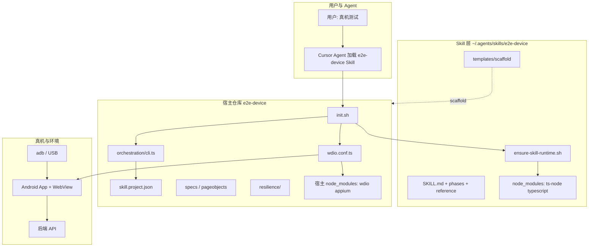
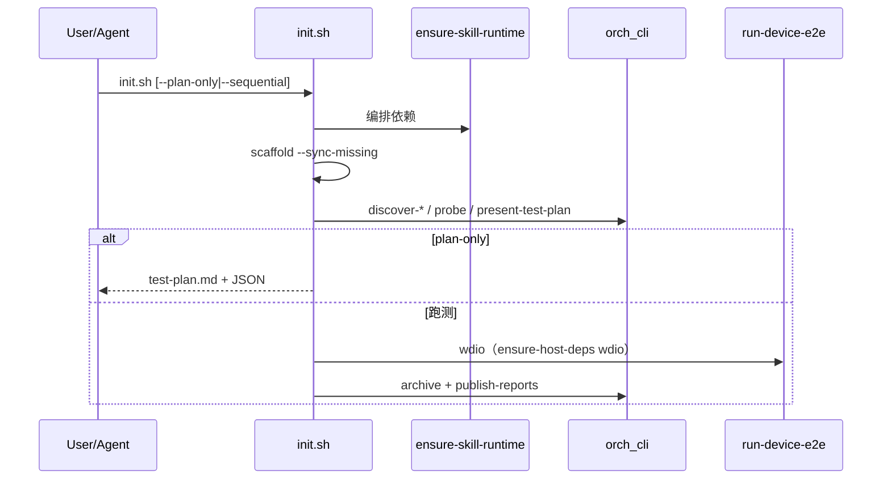

# e2e-device：设计架构 · 功能说明 · 使用指南

> 本文档由 **测试专家**、**Skill 专家**、**全栈专家（Android + Hybrid + H5）** 共识整理，合并以下演进计划与当前实现：
>
> - `真机_e2e_通用_skill`、`e2e-device_全链路增强`、`真机e2e韧性流程`、`jian-h5_真机_e2e`
> - `e2e-device_项目无关合并`、`e2e-device_profile_合并`、`e2e-device_合并含鉴权域名`
>
> **事实来源**：`~/.agents/skills/e2e-device/`（Skill）+ 各宿主仓库 `e2e-device/`（运行时）+ `skill.project.json`（项目契约）。

---

## 1. 产品定位

**e2e-device** 是一套面向 **Android USB 真机 + App 内 WebView H5** 的端到端自动化方案，以 **Cursor Agent Skill** 形式交付，目标是：

| 对象 | 目标 |
|------|------|
| **用户** | 只说「真机测试 / 真机 E2E」，不必记 Appium、wdio、域名、fixture 路径 |
| **Agent** | 单入口编排、门禁话术、失败分流，禁止手工拼 10+ 条 shell |
| **宿主仓库** | 任意 Hybrid H5 项目（React history / Vue hash 等），通过 discover + manifest 接入 |
| **试点** | jian-h5（`damageMisapply`）、xrk（`WorkBench`）等，**试点不是 Skill 边界** |

**不覆盖**：无 USB 真机的纯 Playwright 浏览器 E2E；无 Android 设备时的「模拟通过」。

---

## 2. 三联专家共识（设计铁律）

### 2.1 Skill 专家：零硬编码 + 单入口

| 编号 | 铁律 | 落地 |
|------|------|------|
| G1 | Skill 正文不得出现具体包名、域名、业务 domain | `validate-skill-dry-run.sh` 扫描禁止词；模板仅用 `{{pilotDomain}}` 等占位 |
| G2 | 项目差异只在宿主 `skill.project.json` | `discover-project` 生成；Agent 禁止凭记忆填默认环境 |
| G3 | 用户唯一主入口 | `bash e2e-device/scripts/init.sh` |
| G4 | 聪明在脚本，不在口水 | `orch_cli` + JSON（probe、registry、archive）驱动 Agent |
| G5 | 宁可多测 | 用例来源 = matrix ∪ specs ∪ git-diff ∪ chaos，再按 **磁盘是否存在 spec** 过滤 |

### 2.2 测试专家：可观测、可恢复、可归档

- **门禁**：adb → Appium → 测试计划确认 → 逐 case 执行（`cases-executed.jsonl`）
- **韧性**：诊断 → 分类 → mock-first / autofix → 四段报告（已测 / 已发现 / 已解决 / 待解决）
- **Profile**：`fast` / `full` / `recovery` + `verify-coverage`（strict / partial）
- **AUTH_RECOVERY**：鉴权失败 **blocked_auth**，不 mock、不 autofix；sequential 续跑

### 2.3 全栈专家：Hybrid 三层

| 层 | 名称 | 职责 | 典型故障 |
|----|------|------|----------|
| **L0** | Native 容器 | 包名、Activity、登录控件、DeepLink、adb | 未登录、Activity 错、USB 未授权 |
| **L1** | Hybrid 通道 | WebView 路由、page/api origin、Cookie 域 | URL 错 host、hash/history 模式错、跳登录页 |
| **L2** | 业务 H5 | spec、pageobject、fixture、mock.routes | 列表空、接口 500、DOM 未 ready |

**原则**：L2 问题不能用 L0 代理（Whistle）默认顶替；auth 类问题 **禁止** inject mock 绕过。

---

## 3. 系统架构总览



### 3.1 依赖分层（当前实现）

| 用途 | 安装位置 | 安装方式 |
|------|----------|----------|
| discover / probe / plan / archive | **Skill** `~/.agents/skills/e2e-device/node_modules` | `ensure-skill-runtime.sh` 或 `cd` Skill 目录 `npm install` |
| wdio 跑 spec、appium service | **宿主仓** `node_modules` | `ensure-host-deps.sh wdio`（可自动 npm/yarn add） |

**禁止**：为编排依赖 `export` 其它项目的 `node_modules`。

---

## 4. 目录与职责

### 4.1 Skill 目录（跨项目复用）

```
~/.agents/skills/e2e-device/
├── SKILL.md                 # Agent 主决策树、硬性规则
├── package.json             # 编排运行时依赖
├── scripts/
│   ├── ensure-skill-runtime.sh
│   ├── validate-skill-dry-run.sh
│   └── sync-legacy-templates.sh
├── templates/scaffold/      # 同步到宿主的唯一模板源
├── templates/e2e-device/    # 已废弃镜像，由 sync-legacy-templates 对齐
├── reference/               # 契约与本文档
├── phases/                  # 测试前 / 中 / 后
└── questionnaire-first-run.md
```

### 4.2 宿主目录（每仓库一份）

```
<host-repo>/e2e-device/
├── skill.project.json       # 项目契约（discover 生成，可手改）
├── skill.project.yaml       # 同上，人类可读
├── scripts/
│   ├── init.sh              # 唯一用户入口
│   ├── scaffold.sh          # 从 Skill 模板同步基础设施
│   ├── ensure-host-deps.sh  # 仅 wdio/appium
│   └── run-device-e2e.sh
├── orchestration/           # CLI：discover、probe、sequential…
├── config/                  # env.ts、app.ts、run-profile.ts
├── helpers/                 # login、webview、build-h5-url、suite-entry…
├── specs/                   # 业务用例（Skill 不覆盖）
├── pageobjects/
├── resilience/              # 韧性层（业务 classifier 可扩展）
├── fixtures/                # JSON mock 数据
├── inject/web-request-mock.js
├── wdio.conf.ts             # 可由 template 首次生成
└── artifacts/               # gitignore：报告、runs、截图
```

---

## 5. 核心功能模块

### 5.1 脚手架（scaffold）

- **命令**：`bash e2e-device/scripts/scaffold.sh`（`--sync-missing` 仅补缺）
- **行为**：从 `templates/scaffold` 同步 orchestration、inject、脚本、通用 helpers；**不覆盖** `specs/`、`pageobjects/`、业务 `fixtures/`
- **额外**：若无 `wdio.conf.ts` 且存在 `wdio.conf.template.ts`，自动复制生成

### 5.2 项目发现（discover-project）

自动推断并写入 `skill.project.json`：

| 维度 | 探测来源（多栈） |
|------|------------------|
| App 包名 / Activity | `e2e-device/config/app.ts`、宿主 App 配置 |
| 路由模式 | React `HashRouter` / Vue `mode: 'hash'` → `routingMode` |
| 页面 origin | `e2e-device/config/env.ts` 的 `H5_HOST` 等 |
| API origin | `src/config/env.js` 嵌套环境；Vue `src/service/index.js` 的 `apiXxx = '//host'` |
| pilot.domain | 已有 spec 名 > manifest anchor > e2e-shared > 页面目录 |
| mock.routes | 扫描 `src/services` / `src/service` 字面路径 + fixtures 目录绑定 |

### 5.3 用例发现（discover-cases --union）

| 来源 | 说明 |
|------|------|
| matrix | bootstrap +（若存在）`${domain}.smoke.spec.ts` |
| specs-dir | 已有 `*.spec.ts` |
| git-diff | 仅当对应 spec **文件存在** |
| chaos | `chaos-case-registry.json` 且 spec 存在 |

**关键**：union 后 **filterCasesWithExistingSpecs**，避免 test-plan 出现幽灵用例。

### 5.4 意图（discover-intent）

- 默认 **manifest.pilot.domain** 优先于 git-diff
- 强制 diff 覆盖：`E2E_INTENT_USE_GIT_DIFF=1`

### 5.5 环境探测（probe-env）

输出 `ok`、`blockers[]`、`questions[]`、`snapshot`（adb、appium、node 等）。

常见 blocker：`adb_no_device`、`appium_missing`、`page_origin_unknown`。

### 5.6 L2 就绪（l2-readiness）

- registry 中 spec 文件缺失 → blocker
- **L1-only**（仅 bootstrap）：不强制 `mock.routes` 非空
- L2：检查 fixture 文件、inject 规则可序列化

### 5.7 单入口（init.sh）



| 参数 | 含义 |
|------|------|
| `--plan-only` | discover + probe + `test-plan.md`，不启动 wdio |
| `--sequential` | 按 `case-registry.json` 逐 spec 起进程（AUTH_RECOVERY 续跑友好） |
| `--phase=pre` | 只跑 pre，不进入 during |

### 5.8 Hybrid 打开 H5（L1）

- **buildH5Url**：manifest `pageOrigin` + `pathPrefix` / `hashPrefix` + pilot 路由
- **openH5ViaManifest / DeepLink**：`hybrid.deepLink.scheme` + 编码后的 url
- **switchToWebViewContaining**：匹配 `webViewUrlAnchor`；DOM ready 用 `E2E_DOM_READY_MARKERS` 或 url 片段

### 5.9 Mock（L2，默认 inject）

| 步骤 | 组件 |
|------|------|
| 规则来源 | `skill.project.json` → `mock.routes` + `profileRouteMap` |
| 加载 fixture | `resilience/fixture-loader.ts`（`mock.fixtureDir`，兼容子目录） |
| 注入 | `inject/web-request-mock.js` hook fetch/XHR |
| 启用 | `enable-web-mock.ts` / wdio `onPrepare` |
| 遗留 | `E2E_LEGACY_FIXTURE_MAP=1` 回退试点 fixture-map（仅宿主存在时） |

**不用 CDP Mock 作为主路径**（WebView CDP 在真机场景不可靠）；韧性层 **mock-first**。

### 5.10 韧性层（resilience）

```
runResilientCase(caseId, profile, fn)
  → collectDiagnostics()
  → classify()   // 优先级: auth > page_host > param > emptyData > backend
  → authRequired? → 写 auth-recovery.json, exit 42, outcome blocked_auth
  → attemptAutoFix?（可关 E2E_RESILIENCE_AUTOFIX_SRC）
  → enableWebMock / pass_with_mock
  → issue-ledger + resilience-report.json|md
```

### 5.11 鉴权与域名（Phase 0.6）

| 能力 | 说明 |
|------|------|
| `applyCredentials` | env / `credentials.ts` → 进程环境（不进 archive） |
| `ensureLoggedIn` | Native 登录页 resourceId |
| `auth-detect` | H5 登录文案、API 401/业务码 |
| `auth-recovery.json` | 触发 AUTH_RECOVERY 问卷；**sequential 重跑** |
| `page_origin_stale` | local `E2E_H5_ORIGIN` 与 manifest 不一致 → warn |
| `buildH5Url` | 单一 page origin 运行时源 |

### 5.12 Profile 与覆盖率

| Profile | 场景 | 韧性 | Appium 重启 |
|---------|------|------|-------------|
| **fast** | 日常 / Agent | expert | 尽量单次 wdio |
| **full** | 发版定责 | full | 可多次 |
| **recovery** | 污染后续跑 | 按需 | partial 门禁 |

`verify-coverage`：结合 `cases-executed.jsonl` 与 matrix core；`blocked_auth` 不计 pass。

### 5.13 报告与归档

| 产物 | 路径 |
|------|------|
| 测试计划 | `e2e-device/test-plan.md` |
| 单次运行 | `artifacts/runs/<runId>/`（archive.md、jsonl） |
| 韧性报告 | `artifacts/resilience-report.md` |
| 发布 | `publish-reports` → `docs/guazi-flow/<task>/e2e-device/`（若存在） |

---

## 6. Agent 使用指南

### 6.1 阅读顺序（强制）

与 [SKILL.md](../SKILL.md) 保持一致：

1. [security.md](../security.md)
2. **本文档**（架构与功能总览）
3. [host-setup.md](host-setup.md)
4. [android-sdk-setup.md](android-sdk-setup.md)
5. [agent-gates.md](agent-gates.md)
6. [phases/01-pre-test.md](../phases/01-pre-test.md) → [02](../phases/02-during-test.md) → [03](../phases/03-post-test.md)
7. [mock-strategies.md](mock-strategies.md)
8. 分支不明时：[decision-trees.md](decision-trees.md) / [failure-triage.md](failure-triage.md)

### 6.2 主决策树（简版）

```
用户: 真机测试
  → 仓库有 e2e-device/scripts/init.sh？
      否 → scaffold.sh --sync-missing
  → ensure-skill-runtime（init 内自动）
  → init.sh --plan-only → 展示 test-plan → 用户确认或 10s 默认
  → init.sh 或 init.sh --sequential
  → 失败 → diagnose-run / resilience-report
  → 有 auth-recovery.json → AUTH_RECOVERY 问卷 → sequential 续跑
  → publish-reports → 告知 docs 路径
```

### 6.3 门禁话术（禁止裸命令清单）

| 阶段 | Agent 行为 |
|------|------------|
| adb | 等用户「已连接」，不罗列 adb devices 三步 |
| Appium | AskQuestion 安装或 5s 默认同意 → `install-appium` |
| 计划 | 展示 `test-plan.md`，确认或 10s 默认 |
| 跑测 | TodoWrite：`[i/N] caseId — outcome` |

### 6.4 首跑 vs 二跑

| 条件 | 问卷 |
|------|------|
| `initialized !== true` | 最多 1～2 问（`E2E_PAGE_ORIGIN`、`E2E_CREDENTIALS` 等） |
| `initialized === true` 且无 blockers | **禁止**首跑问卷 |
| `auth-recovery.json` | **允许** AUTH_RECOVERY（规则 8 例外） |

---

## 7. 宿主项目接入指南

### 7.1 新仓库（5 步）

1. 在仓库根执行：`bash e2e-device/scripts/scaffold.sh`（由 Agent 从 Skill 拷贝模板）
2. 准备 `specs/00-bootstrap.spec.ts`（冷启动 + 打开 pilot 页）
3. 复制 `wdio.conf.template.ts` → `wdio.conf.ts`（或由 scaffold 自动生成）
4. 配置真机：`E2E_ACCOUNT`、`E2E_PASSWORD`、`ANDROID_UDID`（或 `.e2e-local.json`）
5. `bash e2e-device/scripts/init.sh --plan-only` → 检查 `skill.project.json` → `init.sh` 全量

### 7.2 已有 e2e-device 的仓库

```bash
bash e2e-device/scripts/scaffold.sh          # 覆盖基础设施
bash e2e-device/scripts/init.sh --plan-only
```

### 7.3 Vue hash 项目（如 xrk）注意点

- discover 读 `src/router/index.js`、`src/page/**`
- bootstrap spec 内可设 `E2E_DOM_READY_MARKERS`
- manifest 中显式 `pilot.domain`（避免被 git-diff 其它页面干扰）
- wdio / appium 仅用 **本仓** `node_modules`

### 7.4 React history 试点（如 jian-h5）

- L2 需 `fixtures/` + `mock.routes` + 业务 specs
- 可保留 `e2e-shared/<domain>.routes.ts`
- `E2E_LEGACY_FIXTURE_MAP=1` 仅过渡 legacy fixture-map

---

## 8. 环境变量速查

| 变量 | 层级 | 说明 |
|------|------|------|
| `E2E_DEVICE_SKILL_ROOT` | Skill | Skill 根目录 |
| `E2E_AUTO_INSTALL_SKILL_RUNTIME` | Skill | 缺编排依赖时 Skill 内 npm install |
| `E2E_AUTO_INSTALL_DEPS` | 宿主 | 缺 wdio 时宿主仓 install |
| `E2E_ACCOUNT` / `E2E_PASSWORD` | 宿主 | 登录凭据（禁止写入报告） |
| `E2E_H5_ORIGIN` / `E2E_API_ORIGIN` | 宿主 | 覆盖 manifest 域名 |
| `E2E_ENABLE_WEB_MOCK` | 宿主 | `1` 启用 inject |
| `E2E_RESILIENCE` | 宿主 | 韧性开关 |
| `E2E_DATA_MODE` | 宿主 | `test` / `mock` |
| `E2E_L1_ONLY` | 宿主 | 仅 bootstrap 时强制 L1 门禁 |
| `E2E_INTENT_USE_GIT_DIFF` | 宿主 | 用 diff 覆盖 manifest pilot |
| `E2E_USER_INTENT` | 宿主 | 自然语言意图 → discover-intent |
| `E2E_DOM_READY_MARKERS` | 宿主 | WebView DOM 就绪子串 |

---

## 9. 计划演进对照（历史追溯）

| 计划文档 | 核心交付 | 在当前 Skill 中的落点 |
|----------|----------|------------------------|
| 真机_e2e_通用_skill | 零硬编码、init 单入口、discover/union/chaos、archive | `init.sh`、`discover-*`、`skill.project.json` |
| jian-h5_真机_e2e | 试点 damageMisapply、fixtures、wdio | 宿主 specs/fixtures（非 Skill 正文） |
| 真机e2e韧性流程 | 诊断、分类、autofix、CDP→inject | `resilience/*`、`run-resilient-case` |
| e2e-device_全链路增强 | Skill 更名、inject mock、agent-gates、sequential、publish | `e2e-device` 目录、phases、reference |
| e2e-device_项目无关合并 | manifest mock、L2 readiness、模板去试点 | `manifest-mock-rules`、`l2-readiness`、scaffold |
| e2e-device_profile_合并 | fast/full/recovery、coverage、suite-entry | `run-profile.ts`、`suite-entry.ts` |
| e2e-device_合并含鉴权域名 | authRequired、AUTH_RECOVERY、buildH5Url、page/api 分源 | `auth-*`、`build-h5-url`、`probe-env` |

---

## 10. 验收与自检清单

### 10.1 Skill 维护者

```bash
bash ~/.agents/skills/e2e-device/scripts/ensure-skill-runtime.sh
bash ~/.agents/skills/e2e-device/scripts/validate-skill-dry-run.sh
bash ~/.agents/skills/e2e-device/scripts/sync-legacy-templates.sh  # 改模板后
```

### 10.2 宿主仓库（最低）

```bash
bash e2e-device/scripts/init.sh --plan-only   # exit 0，test-plan 无幽灵 spec
# 有真机 + 凭据后：
bash e2e-device/scripts/init.sh               # bootstrap 通过
```

### 10.3 建议仍由宿主自行完成的项

- [ ] 全量 smoke/nav 在目标环境绿（依赖 TEST 数据 / mock）
- [ ] CI 预置 `E2E_ACCOUNT`/`E2E_PASSWORD`（AUTH_RECOVERY 仅本地）
- [ ] `prepare-device.sh` 首次安装 Appium 辅助 APK
- [ ] chromedriver 大版本与 WebView Chrome 匹配

---

## 11. 故障排查索引

| 现象 | 优先查看 |
|------|----------|
| plan-only 报 ts-node | Skill 目录 `npm install` / `ensure-skill-runtime` |
| wdio 找不到 | 宿主 `ensure-host-deps.sh wdio` |
| test-plan 含不存在 spec | 重跑 `discover-cases --union`；检查 filter 逻辑 |
| WebView 找不到 | `webViewUrlAnchor`、`E2E_DOM_READY_MARKERS` |
| 列表空 / 接口错 | `resilience-report`；L2 mock.routes / fixture |
| 登录弹窗 | `auth-recovery.json` → AUTH_RECOVERY 流程 |
| 域名不对 | `E2E_H5_ORIGIN`、`discover-project`、manifest `pageOrigin` |

更细的分流见 [failure-triage.md](failure-triage.md)、[decision-trees.md](decision-trees.md)。

---

## 12. 相关文档索引

| 文档 | 路径 |
|------|------|
| Agent 主入口 | [SKILL.md](../SKILL.md) |
| 宿主依赖分层 | [host-setup.md](host-setup.md) |
| Hybrid 字段 | [hybrid-contract.md](hybrid-contract.md) |
| Mock 策略 | [mock-strategies.md](mock-strategies.md) |
| 安全 | [security.md](../security.md) |
| 归档 schema | [archive-schema.md](archive-schema.md) |
| 用例来源 | [case-sources.md](case-sources.md) |
| jian-h5 任务计划（试点） | 宿主 `docs/guazi-flow/2026-05-28-jian-h5真机E2E/index.md` |

---

*文档版本：与 2026-05-29 Skill 通用化收尾实现同步。变更 Skill 实现时请同步更新本节与 [host-setup.md](host-setup.md)。*
